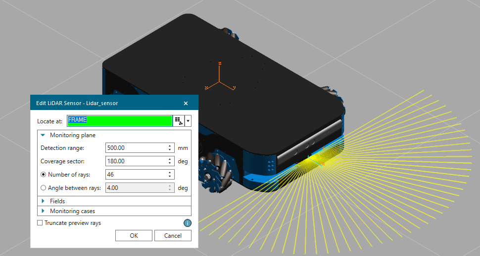

**This document originally writen as part of my graduation project team thesis submission.**

**Converted from .docx to markdown**

# **Implementation of Advanced Simulation for the AMR in Siemens Tecnomatix Process Simulate**

## **Introduction**

This chapter details the process and challenges encountered in implementing an advanced simulation for an Autonomous Mobile Robot (AMR) using Siemens Tecnomatix Process Simulate software. The simulation was part of a planned warehouse automation scenario utilizing AMRs.

## **Selection of Process Simulate**

### **Integration with ROS# Using Process Simulate .NET API**

One of the significant advantages of Siemens Tecnomatix Process Simulate is its .NET API (Siemens Industry Software Inc., n.d.), which enables seamless integration with various applications, including ROS environments. By leveraging ROS# (opensource.siemens.com, n.d.), a library that connects ROS environments with .NET applications, we were able to integrate our AMR with Process Simulate effectively. This integration facilitated advanced simulations and the application of autonomy algorithms necessary for warehouse automation.

|||
| :-: | :-: |
|**Figure 1: PS Starting Façade**|**Figure 2: ROS# Logo**|

### **Advanced Sensor Integration**

Process Simulate offers a range of components that are crucial for developing and testing autonomy algorithms. Notable among these components are:

- **RGBD Camera (Siemens Industry Software Inc., n.d.)**: This sensor provides both color (RGB) and depth (D) information, essential for visual perception tasks like object detection, tracking, and navigation.
- **LiDAR Sensor (Siemens Industry Software Inc., n.d.)**: LiDAR is critical for precise distance measurement and 3D mapping, enabling the robot to understand and navigate its environment accurately.

<table><tr><th colspan="1"></th><th colspan="1" rowspan="2"></th></tr>
<tr><td colspan="1"></td></tr>
<tr><td colspan="1" valign="bottom"><b>Figure 3: LiDAR and Camera in PS</b></td><td colspan="1" valign="bottom"><b>Figure 4: LiDAR Dialog in PS</b></td></tr>
</table>

These sensors can send data to the ROS environment, where various autonomy algorithms can process the information to perform tasks such as obstacle avoidance, path planning, and environment mapping.

### **Integration with Automation Tools**

Another key benefit of Process Simulate is its ability to integrate with automation tools, specifically Siemens TIA Portal PLCSIM Advanced (Siemens Industry Software Inc., n.d.). This integration allows for:

- **Simulation of Industrial Automation Systems**: We can create and test automated workflows involving both robots and PLC-controlled machinery.

||
| :-: |
||
|**Figure 5: PLCSIM Dialog in PS**|

### **Built-in Functionalities for Automation**

Process Simulate provides built-in functionalities that are particularly useful for automating warehouse operations:

- **Conveyor Process Simulation (Siemens Industry Software Inc, n.d.)**: We can model and simulate conveyor systems, allowing us to test how AMRs interact with other material handling equipment.
- **Object Flow Management (Siemens Industry Software Inc, n.d.)**: The software enables detailed simulation of object flow, helping to optimize the movement of goods within the warehouse.

|||
| :-: | :-: |
|**Figure 6: Conveyor Panel in PS**|**Figure 7: Create Object Flow in PS**|

### **Variety of Industrial Sensors**

Process Simulate supports a range of industrial sensors, which can be integrated into simulations to enhance the robot's capabilities:

- **Proximity Sensors**: Useful for detecting objects flowing on a conveyor.
- **Photoelectric Sensors**: Can be used like proximity sensors.

||
| :-: |
||
|**Figure 8: Sensors available in PS**|

These sensors allow for more comprehensive and realistic industrial automations simulations.

## **Model Preparation and Import**

The initial step involved converting the mechanical model from SolidWorks (.sldprt format) to JT format, which is the only 3D modeling format accepted by Process Simulate. This JT file was then imported as a robot device, enabling programmatic interaction with the robot using the Tecnomatix.NET API.

||
| :-: |
||
|**Figure 9: Mechanical model after importing in PS**|

## **Kinematics Definition**

The robot's kinematics were defined in detail:

1. Four mecanum wheels, each with multiple rollers
1. Wheel kinematics in relation to the base chassis
1. Roller kinematics in relation to their respective wheels
1. Lifting mechanism (30mm vertical movement)
1. Overall robot kinematics: 
   1. 8 linear directions (straight, side, diagonal 45°, diagonal 135° in positive and negative)
   1. 2 angular directions (positive and negative rotation about its axis)

||
| :-: |
|**Figure 10: Illustration of linear axis of the AMR**|

## **Kinematic Implementation Challenges**

### **Initial Approach: Dynamic Joint**

The first attempt utilized a single joint from the base to the footprint, dynamically changing between axes and joint types (prismatic to revolute) based on the desired movement. A driver program was implemented to manage these changes, which worked well in static scenarios but failed during real-time simulation due to limitations in modifying joints during active simulations.

||
| :-: |
|**Figure 11: Kinematics tree after definition (Initial Approach)**|

### **Revised Approach: Multiple Fixed Joints**

To overcome the limitations of the dynamic joint approach, the strategy was revised to use five fixed joints representing the main axes of movement:

1. Straight
1. Side
1. Diagonal 45°
1. Diagonal 135°
1. Circular (rotation around itself)

This approach eliminated the need for creating and deleting joints during simulation.

||
| :-: |
|**Figure 12: Revised Approach: Multiple Fixed Joints**|

## **Integration with ROS**

The ROS# library by Siemens was utilized to subscribe to movement commands from the ROS environment. This required handling incoming ROS messages within Process Simulate and translating them into appropriate robot movements.

**The function that process the message coming from ROS**

## **Dynamic Axis Adjustment**

To account for the robot's changing orientation, trigonometric calculations were implemented to dynamically adjust the four linear axes of movement based on the robot's current rotation.

||
| :-: |
|**Figure 13: Illustration of side effects of orientation**|

## **Performance Limitations**

Despite successfully implementing the desired movement capabilities, Process Simulate struggled to render the robot's movements smoothly due to the high frequency of incoming ROS commands. This revealed a significant limitation in using Process Simulate for this particular application.

## **Reflection on Software Choice**

While Process Simulate offered many desirable features, its inability to handle high-frequency commands proved to be a critical limitation for this specific AMR simulation. This experience highlighted the importance of thoroughly evaluating software capabilities against specific project requirements, particularly for dynamic, real-time applications like AMR control.

## **Future Work and Alternatives**

The goal of using Process Simulate was to leverage its built-in capabilities for integration with automation tools like Siemens TIA Portal PLC SIM Advanced. We planned to implement a coordinated automation system featuring communication between the robot and PLC through the MQTT protocol. However, due to its limitations in handling high-frequency commands, we considered alternatives like: 

- **Unity Game Engine**: Siemens offers strong support for ROS (opensource.siemens.com, n.d.) and automation integration with SIMIT (Siemens AG, n.d.) software using Unity. This could provide a more suitable platform for high-frequency command processing.

Due to project timeline constraints, exploration of these alternatives was deferred to future work.

## **Conclusion**

The implementation of an advanced AMR simulation in Tecnomatix Process Simulate revealed both the software's strengths in automation integration and its limitations in handling high-frequency robot commands. While the project achieved its primary goals of simulating complex robot kinematics and ROS integration, it also highlighted the importance of carefully selecting simulation tools based on specific project requirements.

The experience gained from this implementation provides valuable insights for future projects, emphasizing the need for a balance between comprehensive features and real-time performance in simulation software selection. As the field of warehouse automation and AMR technology continues to evolve, the lessons learned from this project will inform better decision-making in choosing simulation environments for complex, dynamic systems.
# **References**
opensource.siemens.com. (n.d.). *github - siemens / ros-sharp*. Retrieved from https://github.com/siemens/ros-sharp

opensource.siemens.com. (n.d.). *siemens - ros-sharp - unity plugin*. Retrieved from https://github.com/siemens/ros-sharp/tree/master/com.siemens.ros-sharp

Siemens AG. (n.d.). *SIMIT – Unity Coupling*. Retrieved from https://www.industry-mobile-support.siemens-info.com/en/article/detail/109769816

Siemens Industry Software Inc. (n.d.). *Process Simulate - Conveyors*. Retrieved from https://docs.sw.siemens.com/en-US/doc/288782031/PL20231017544579710.tecnomatix_eMS.xid1015765/Conveyor

Siemens Industry Software Inc. (n.d.). *Process Simulate - New Object Flow Operation*. Retrieved from https://docs.sw.siemens.com/en-US/doc/288782031/PL20231017544579710.tecnomatix_eMS.xid1015765/xid704321

Siemens Industry Software Inc. (n.d.). *Process Simulate - Camera*. Retrieved from https://docs.sw.siemens.com/en-US/doc/288782031/PL20231017544579710.tecnomatix_eMS.xid1015765/xid1266244

Siemens Industry Software Inc. (n.d.). *Process Simulate - Create a PLCSIM Advanced connection*. Retrieved from https://docs.sw.siemens.com/en-US/doc/288782031/PL20231017544579710.tecnomatix_eMS.xid1015765/xid1402906

Siemens Industry Software Inc. (n.d.). *Process Simulate - LiDAR*. Retrieved from https://docs.sw.siemens.com/en-US/doc/288782031/PL20231017544579710.tecnomatix_eMS.xid1015765/xid1932784

Siemens Industry Software Inc. (n.d.). *Tecnomatix.NET API*. Retrieved from https://docs.sw.siemens.com/en-US/doc/288782031/PL20231017544579710.TecnomatixNET-API-Tecnomatix2402.NET-API-doc

